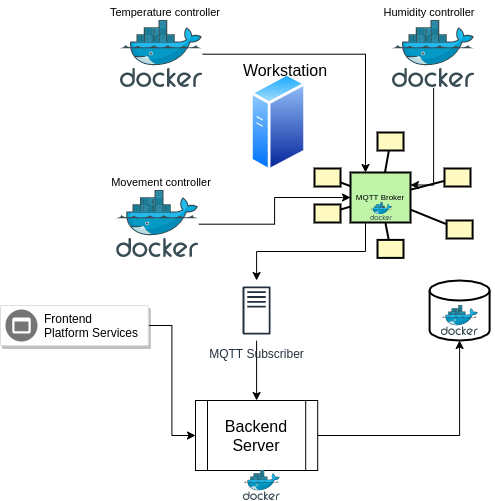

# IOTAP-design
Full project design

## Pipeline
1. Development in dev branches
2. Push to origin/dev
3. Code analysis (Sonar Cloud)
4. Build + UnitTest (TravisCI)
5. Docker container (TravisCI)
6. Download docker and run locally with compose
